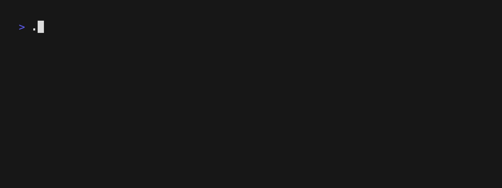

# Chatterbox CLI

Chatterbox CLI is a simple chat application that runs on the command line interface. It is a learning exercise that demonstrates the use of Go language for network programming, cryptography for secure communication, and the Bubbletea library for building user interfaces in the terminal.

This project includes a server and a client that communicate over TCP. The server can handle multiple client connections. The messages are encrypted and decrypted using a Diffie-Hellman key exchange and AES encryption for secure communication.

## Building the Project

To build this project, you need to have Go installed on your machine. Once you have Go set up, navigate to the project directory and execute the following command:

```bash
go build -o chatterbox
```

This command will build the project and create an executable file named "chatterbox".

## Running the Server

To start the server, run the following command:

```bash
./chatterbox -server
```

This command will start the server that listens for incoming connections.



## Running the Client

To start the client, run the following command:

```bash
./chatterbox
```

This will start the client. You will be prompted to enter a username and the server's address.


## Learning Experience

This project is a great exercise in understanding network programming with Go, cryptography for secure communication, and building terminal user interfaces with the Bubbletea library. It provides a hands-on learning experience on how to handle multiple client connections in a server, how to perform key exchanges for secure communication, and how to build and manage user interfaces in the terminal.

## Note

This project is purely for learning and skill-building purposes. It is not intended to be used for production-level applications.
